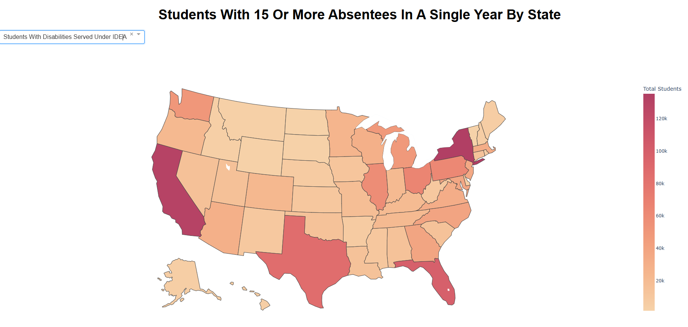

# Data Visualization: US Student Absenteeism (2015-2016)

## Overview
This project visualizes student absenteeism data across the United States. The dataset includes information on absentee rates (15+ absences per year) by state, categorized by disability status and race. The data is represented on an interactive map, where users can explore absentee rates across different states and demographics.

## Features
- **Interactive Dashboard**: An interactive dashboard of the United States where users can click on each state to view absenteeism data.
- **Data Filtering**: Users can filter data by different demographics (disability status and race) to gain deeper insights into student absenteeism patterns.

## Technologies Used
- **Python**: For data processing and analysis using pandas.
- **Plotly and Dash**: For creating the interactive map.
- **Jupyter Notebooks**: For exploratory analysis and documentation.
- **Render**: For deployment to cloud hosting.

## The visualization is hosted here (please be patient, it might take a minute to load because of hosting):
https://absenteestudentsbystate.onrender.com/

## Screenshot of dashboard

