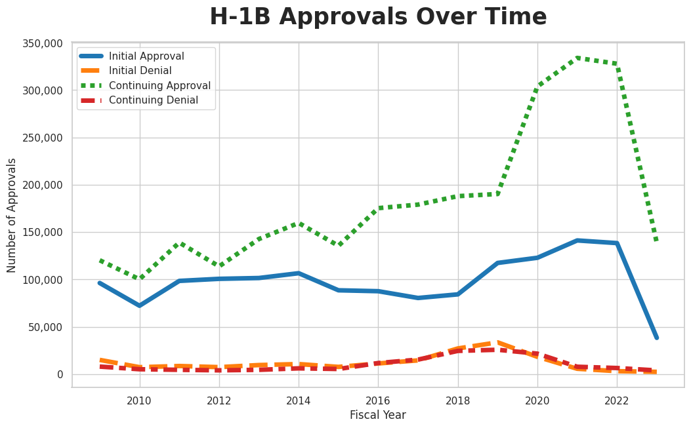

# Data Visualization: H-1B Visa Approvals Over Time

Hosted notebook is available [on colab](https://colab.research.google.com/drive/1Rz_YG0UtCvS_deUtcmjkV_lxchUd48pN).

## Graph of Cumulative Owed Loans

## Methodology
The dataset was obtained from the official [United States Citizenship and Immigration Services website](https://www.uscis.gov/tools/reports-and-studies/h-1b-employer-data-hub/h-1b-employer-data-hub-files).
This timeseries lineplot was created using the python libraries seaborn and matplotlib and required the merging of 15 different CSV files and additional data cleaning.
