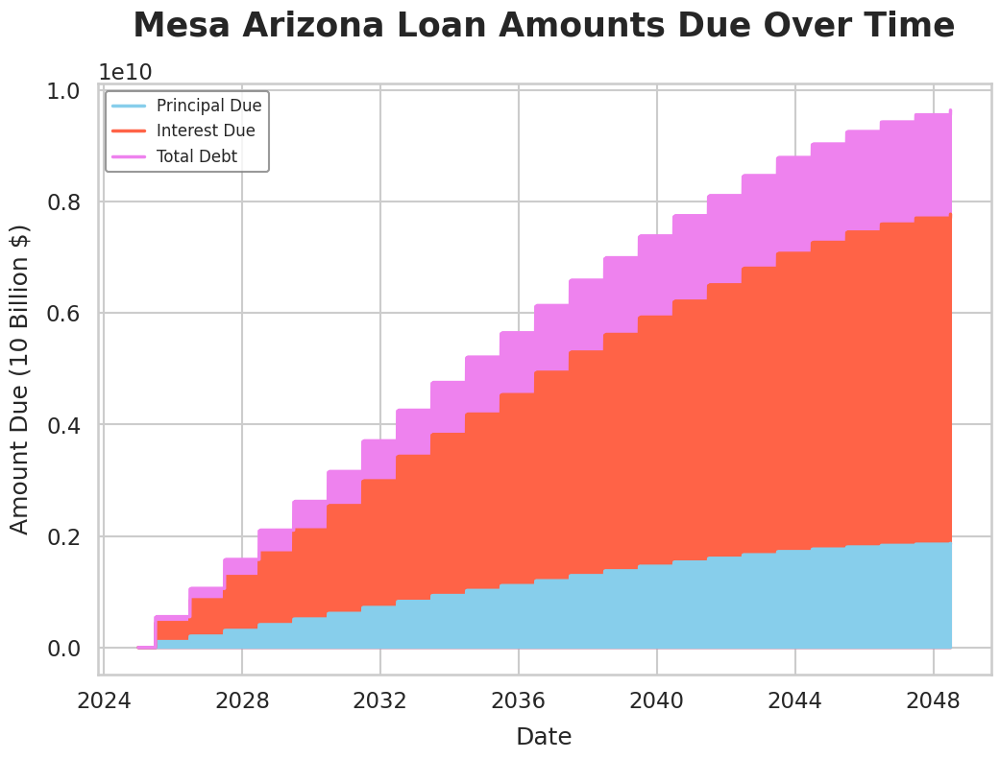

# Data Visualization: Mesa Arizona Outstanding Loans

Hosted notebook is available [on colab](https://colab.research.google.com/drive/1iThINxrnoHwjtwq1hIrDGq-pSenZB0yv#scrollTo=igm55CK66RbK)

## Graph of Cumulative Owed Loans

## Methodology
The dataset was obtained from the official Mesa Arizona [datahub](https://data.mesaaz.gov/Financial-Services/Debt-Service/p2t3-kgkn/about_data)
This timeseries lineplot was created using the python libraries seaborn and matplotlib.
